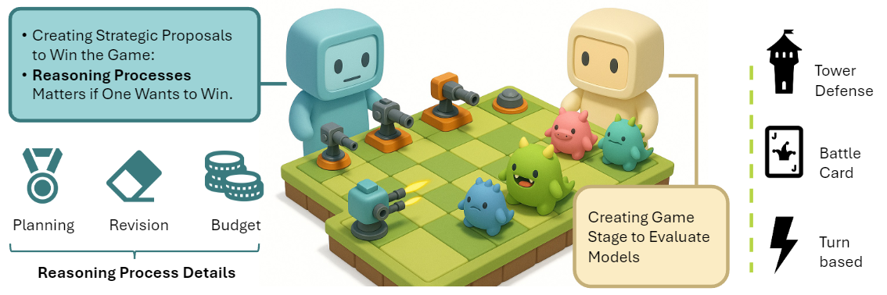

</head>
<body>
  <h1>AdvGameBench</h1>
  

  <!-- arXiv -->
  

  <!-- Hugging Face logo only -->
  

  AdvGameBench is a benchmark that evaluates how LLMs make and revise decisions in strategic games, focusing not just on win rates but on the reasoning process behind those decisions.

  <h2>Why use AdvGameBench?</h2>
  Most benchmarks evaluate LLMs based only on final outcomes like accuracy or win rate, without considering how those results are produced. AdvGameBench addresses this limitation by placing models in closed-loop environments where they must plan, revise, and make decisions under constraints. By tracing not just what the model decides, but how and why it does so, AdvGameBench offers deeper insights into reasoning quality, reliability, and self-correction behavior.

  <h2>Install</h2>
  <pre><code>pip install -r requirements.txt</code></pre>

  <h2>Quick-start command</h2>
  <pre><code># The currently supported models are:
# chatgpt-4o, chatgpt-4.1, chatgpt-o3, chatgpt-o3-mini,
# deepSeek-V3, deepSeek-R1, qwen-plus, qwen-max,
# claude-3-5-sonnet, gemini-2-flash, gemini-2.5-flash

python run_all.py \
    --games "Tower_Defense" "Auto-battler" "Turn-based" \
    --models "chatgpt-4o" \
    --fix-models "deepSeek-V3" \
    --rounds 4 \
    --parallel

# Environment variables
OPENAI_API_KEY="YOUR_KEY_HERE"
DEEPSEEK_API_KEY="..."
QWEN_API_KEY="..."
CLAUDE_API_KEY="..."
GEMINI_API_KEY="..."</code></pre>
</body>
</html>
